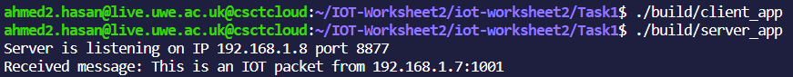
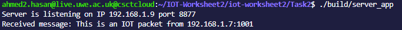
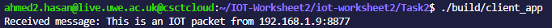

# Task 1: UDP Client-Server Communication

## Introduction
- Understand the basics of UDP communication.
- Implement a UDP client to send a message to a server.
- Develop a UDP server to receive messages from clients.
- Utilize packet streams for communication between client and server.
- Verify successful communication between client and server.

## Prerequisites
- Basic knowledge of C++ programming.
- Understanding of socket programming concepts.
- Familiarity with Linux environment and command-line interface.
- Understanding socket.hpp UWE provided library 

## Tools and Libraries:
- C++ compiler (e.g., g++)
- iot library provided in /opt/iot
- Utility scripts: create_packetfile, packets_clear, iotdump

## Task Overview:
1. Client Implementation: Write a C++ program to create a UDP client that sends a message to a server. Set up the client's IP address, specify the server's address, create a UDP socket, bind it to the client's address, and send the message.

2. Server Implementation: Develop a separate C++ program for the UDP server. Use the recvfrom function to receive messages from clients. Print the received message along with the client's IP address.

3. Makefile Creation: Construct a Makefile to compile the client and server programs into executable binaries. Include necessary flags for compiling C++ source files and linking the iot library.

4. Packet Stream Management: Before running the client and server, create packet streams for communication using the provided utility script create_packetfile. Clear any existing packet streams with packets_clear.

5. Execution and Verification: Run the client and server executables. Verify successful communication by checking the contents of the packet streams using iotdump.

6. Through this task, you will gain practical experience in implementing UDP client-server communication and understand the essential steps involved in setting up and managing UDP sockets. Additionally, you will learn how to use packet streams for data transmission between client and server processes.

## Instructions
- git clone the repo:

    ~~~bash
        https://github.com/AhmadTNofal/UDP-Client-Server-Communication.git

        cd iot-worksheet2

        cd Task1
    ~~~

- Make all files:

    ~~~bash
    make all
    ~~~

 

- Clear the Packets:

    ~~~bash
    /opt/iot/bin/packets_clear
    ~~~

 

- Build the Client app:

    ~~~bash
    ./build/client_app
    ~~~

 

- Build the Server app:

    ~~~bash
    ./build/server_app
    ~~~

 

- Output Verification:  
    

### Client
1. Set the client IP address.
2. Create the server's address structure.
3. Create the UDP socket.
4. Bind the socket to the client's address.
5. Send the message to the server.
6. Prepare packet streams using `create_packetfile`.
7. Run the client executable.

### Server
1. Implement server-side code using `recvfrom`.
2. Update the Makefile to compile the server code.
3. Clear existing packet streams using `packets_clear`.
4. Run the server executable.

## Verification

1. Compile the Programs: Ensure that both the UDP client and server programs are compiled into executable binaries using the provided Makefile or by manually compiling the source files.

2. Clear Packet Streams: Before running the client and server, clear any existing packet streams using the packets_clear utility script. This ensures a clean environment for communication.

3. Run the Client: Launch the client program to send a message to the server. Ensure that the client specifies the correct server IP address and port number.

4. Run the Server: Execute the server program to start listening for incoming UDP packets. The server should be ready to receive messages from the client.

5. Verify Output: After the client sends the message, check the output of the server program. It should display the received message along with the IP address of the client from which the message originated.

6. Repeat as Necessary: Repeat the process as needed to test different message exchanges between the client and server. Ensure that the communication is consistent and reliable under various scenarios.

## How The Output is Produced
~~~c++
    while (true) {
        sockaddr_in client_addr;
        size_t client_addr_len = sizeof(client_addr);

        // Receive a message from a client
        ssize_t msg_len = sock.recvfrom(buffer, sizeof(buffer) - 1, 0,(struct sockaddr*)&client_addr, (size_t*)&client_addr_len);

        if (msg_len < 0) {
            std::cerr << "Error receiving message" << std::endl;
            continue;
        }

        // Null-terminate the received message
        buffer[msg_len] = '\0';

        // Print the received message and sender's address
        std::cout << "Received message: " << buffer << " from " << inet_ntoa(client_addr.sin_addr) << ":" << ntohs(client_addr.sin_port) << std::endl;
    }
~~~
1. Infinite Loop: The while (true) loop ensures that the server keeps running indefinitely, continuously listening for incoming messages from clients.

2. Client Address Structure: A sockaddr_in struct named client_addr is declared. This struct will hold the address information of the client from which the server receives messages.

3. Address Length: The client_addr_len variable is used to store the size of the client_addr struct. This size is needed as an argument for the recvfrom function to determine the actual size of the client's address structure.

4. Receiving Messages: The recvfrom function is called within the loop to receive messages from clients. It takes several arguments:

    - `buffer:` A buffer to store the received message.

    - `sizeof(buffer) - 1:` The maximum length of the message that can be received, ensuring space for a null terminator.

    - `0:` Flags, which are set to 0 for normal operation.

    - `(struct sockaddr*)&client_addr:` A pointer to the client's address structure.

    - `(size_t*)&client_addr_len:` A pointer to the size of the client's address structure.
    
5. Error Handling: If the recvfrom function returns a value less than 0, it indicates an error occurred while receiving the message. In such cases, an error message is printed, and the loop continues to listen for more messages.

6. Null-Terminating the Message: After receiving the message, the server null-terminates it by adding a null character ('\0') at the end of the buffer. This ensures that the received message is treated as a C-style string.

7. Printing Received Message: Finally, the server prints the received message along with the IP address and port number of the client from which the message originated. The inet_ntoa function converts the binary representation of the client's IP address to a human-readable string, while ntohs converts the port number from network byte order to host byte order.

# Task 2: UDP Client-Server Communication and Echoing Back

## Instructions
- git clone the repo:

    ~~~bash
        cd Task2
    ~~~

- Make all files:

    ~~~bash
        make all
    ~~~

 

- Clear the Packets:

    ~~~bash
        /opt/iot/bin/packets_clear
    ~~~

 

- Build the Server app:

    ~~~bash
    ./build/server_app
    ~~~

 

- Build the Client app:

    ~~~bash
    ./build/client_app
    ~~~

 

## Echoing back the message through the Client
- Receiving The Message:
    

- The Echo Back:
    

# Conclusion

In conclusion, I have successfully completed Task 1 of the IoT worksheet, which involved setting up communication between a UDP client and server using the provided library and utilities. Here's a summary of the key points:

- Client Implementation: I implemented a UDP client in C++ that sends a message to a specified server IP address and port number. The client code utilized the provided IoT library for socket communication.

- Server Implementation: Additionally, I developed a UDP server in C++ that listens for incoming messages from clients. The server code also relied on the IoT library for socket operations.

- Packet Streams: To establish communication channels between the client and server, I used the provided create_packetfile utility script to create packet streams for the respective IP addresses and port numbers. This ensured proper communication between the processes.

- Verification Process: I outlined a verification process to ensure that the client and server communicate effectively. This involved compiling the programs, clearing existing packet streams, running the server, running the client, and verifying the output.

